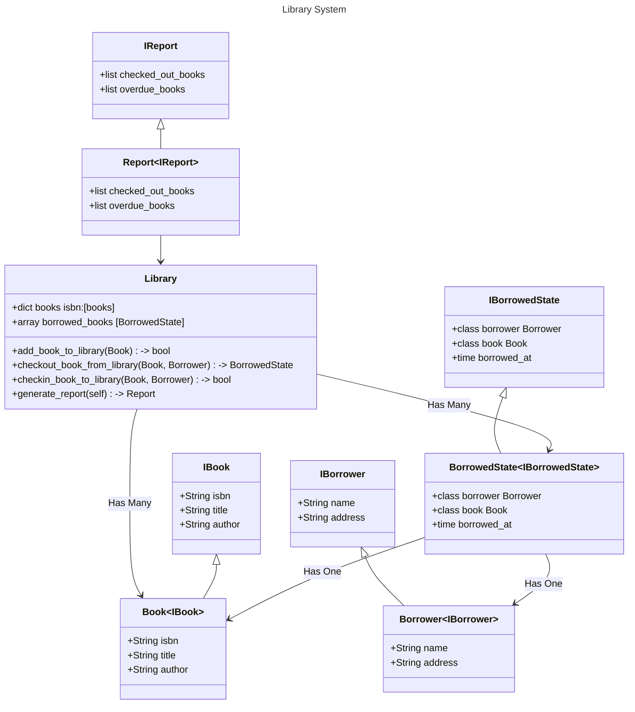

# Library for ChatGPT Senior Interview

## Requirements:
 - Add a new book to the library
 - Search for a book by its title, author, or ISBN
 - Check out a book to a borrower
 - Check in a book from a borrower
 - Generate reports about the books in the library (e.g. books checked out, books overdue, etc.)

 ## Design Class Diagram
